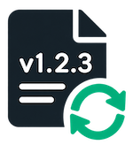

# version-aligner

[](https://packagist.org/packages/stolt/version-aligner)


[](https://github.com/php-pds/skeleton)
[](https://github.com/raphaelstolt/lean-package-validator)

<p align="center">
    
</p>

A small development tool to keep application versions aligned with Git tags and changelog entries.

The `version-aligner` works particularly well with standardized PHP package structures such as those defined by
[pds/skeleton](https://github.com/php-pds/skeleton).

## Why?

Releases can have more than one version source.

For example, a CLI application might have its version defined in the application itself, while the release version is
represented by a Git tag and documented in `CHANGELOG.md`.

It is easy to update the Git tag and changelog while forgetting to bump the version in the application.

That has happened to me several times.

The result is a release where the repository says one thing, while the application reports another:

```text
Git tag       v1.4.0
CHANGELOG.md  1.4.0
Application   1.3.0  ← forgotten
```

`version-aligner` exists to catch exactly this kind of inconsistency.

It checks whether your application's version matches the release version represented by Git and `CHANGELOG.md` before an
outdated version reaches your users.

## What it checks

`version-aligner` compares:

- the latest Git tag
- the latest version in `CHANGELOG.md`
- the version set in the application

All three versions must refer to the same release.

## Installation

The `version-aligner` CLI can be installed through Composer.

``` bash
composer require --dev stolt/version-aligner
```

## Available commands

### Check command

`check` compares the application's version with the latest Git tag and the latest CHANGELOG.md entry.

```bash
version-aligner check [--format=json]
```

```bash
Version alignment

✓ Git tag          v1.0.0
✓ CHANGELOG.md     1.0.0
✗ Application      0.9.0

Version mismatch detected.
```

```bash
Version alignment

✓ Git tag          v1.0.0
✓ CHANGELOG.md     1.0.0
✓ Application      1.0.0

All versions are aligned.
```

You can use it in pre-commit Git hooks, Composer scripts, or continuous integration workflows.

Example Composer script:
```json
{
  "scripts": {
    "version-check": "version-aligner check"
  }
}
```

Evaluable outcomes of the `check` command are:

| Scenario                 | Expected behavior                  |
| ------------------------ | ---------------------------------- |
| All versions match       | Exit `0`                           |
| Version mismatch         | Non-zero exit                      |
| Required source missing  | Clear diagnostic and non-zero exit |
| Git metadata unavailable | Clear diagnostic and non-zero exit |

### Align command

`align` updates the __application__ version when it differs from the release version.

```bash
version-aligner align [--dry-run]
```

## Version discovery

`version-aligner` automatically discovers the application version without requiring configuration.

It checks the following PHP files for a version string (`1.2.3` or `v1.2.3`), in order:

1. Executable files declared in `composer.json`'s `bin` section.
2. `src/Console/Application.php`
3. `src/Application.php`
4. `src/Server.php`

The first matching version string is used as the application's version. If no version is found, discovery returns
`null`.

## License

This library and its CLI are licensed under the MIT license. Please see [LICENSE.md](LICENSE.md) for more details.

## Changelog

All noteworthy changes are documented in the [CHANGELOG.md](CHANGELOG.md).

## Reporting issues

Found a bug or an unexpected version alignment result? Please [open an issue](https://github.com/raphaelstolt/version-aligner/issues).

If version discovery fails or detects an incorrect version, include:

* The expected and detected application versions.
* The relevant `composer.json` and PHP file structure.
* The output of the command you ran.
* Steps to reproduce the issue.

Please remove any sensitive information before sharing files or command output.

## Contributing

If you're considering contributing to this project, have a look at this repository's [CONTRIBUTING.md](.github/CONTRIBUTING.md)
for more advice.